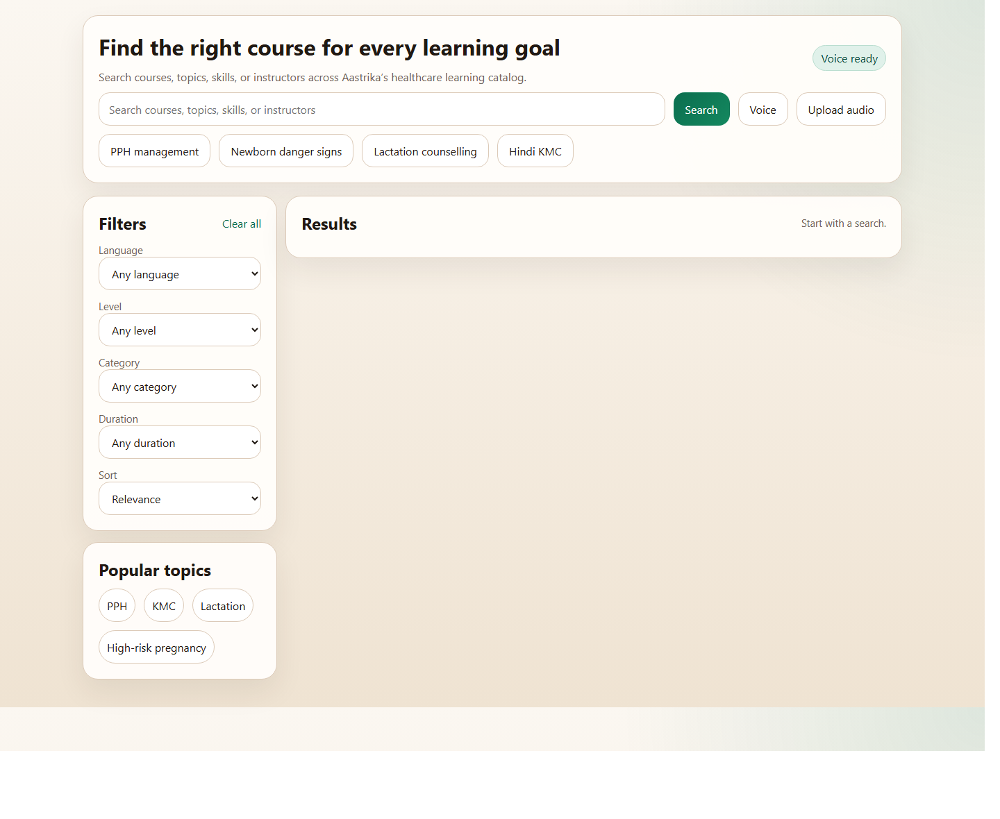

# QueryCore

QueryCore is a search optimisation project for healthcare course discovery. It is built on the premise that the quality of a retrieval system is determined less by interface complexity and more by the rigor of its query processing, ranking design, fallback behavior, and evaluation methodology. The repository is intentionally restrained in size, but the search stack itself is technically ambitious: multilingual normalization, typo-tolerant repair, transliteration-aware matching, hybrid lexical and semantic retrieval, phonetic rescue, confidence-driven reranking, and domain-aware result shaping are composed into a single coherent backend.

Part of this work was done for an internship at Aastrika Sphere, a maternity and midwifery nonprofit.

It should be read as a compact but serious retrieval engineering system, not as an attempt to market a large platform.

## Why This Is Interesting

- It handles exact queries, noisy queries, acronym-heavy queries, missing-space queries, romanized Hindi, and code-mixed inputs inside one retrieval architecture rather than through ad hoc exceptions.
- It combines BM25-style lexical evidence, fuzzy repair, phonetic comparison, and semantic rescue behind a clean REST boundary.
- It is small enough to inspect end-to-end while still exposing indexing, suggestions, health checks, analytics hooks, and voice-search seams.
- It is designed to be consumed by a Java service over HTTP without coupling storage, runtime, or indexing internals.

## System Character

The significance of the project is not that it contains large-scale infrastructure. The significance is that it applies a set of search optimisation techniques with discipline and internal coherence:

- aggressive query cleanup before retrieval
- multiple repair paths for user-input noise
- domain-aware language and transliteration handling
- hybrid evidence accumulation instead of single-score ranking
- rescue logic for difficult queries
- measurable evaluation instead of anecdotal demos

That makes it meaningfully stronger than a basic CRUD-backed search API, even though the codebase remains intentionally approachable.

## Retrieval Pipeline

1. Normalize the query: Unicode cleanup, casing normalization, punctuation removal, repeated-letter reduction, filler-word stripping, and compact-text handling.
2. Repair the query: token-level typo correction, title-level fuzzy repair, compact-title recovery for missing spaces, and transliteration expansion.
3. Infer intent: language preference, difficulty, topical hints, code-mixed detection, and a compressed query summary for downstream retrieval.
4. Retrieve candidates: title/body BM25-style scoring, fuzzy similarity, phonetic overlap, semantic similarity, and rescue behavior when direct lexical evidence is weak.
5. Rerank results: weighted hybrid scoring with phrase overrides, language preference boosts, popularity and recency hooks, and confidence estimation.
6. Enrich the response: explanations, grouped variants, facets, alternate queries, and no-result guidance.

This is implemented primarily in [app/search/query_processor.py](app/search/query_processor.py), [app/search/backend.py](app/search/backend.py), and [app/services/search_service.py](app/services/search_service.py).

## Algorithms And Optimisation Ideas

- BM25-style lexical scoring is computed separately over title terms and broader course text so exact thematic evidence is not diluted by description noise.
- Token-level and whole-query fuzzy repair use explicit confidence thresholds, which avoids the common failure mode of over-aggressive autocorrection.
- Compact-query segmentation and no-space recovery allow collapsed inputs to be reconstructed into meaningful search terms.
- Indic transliteration expansion allows romanized queries to recover Hindi catalog items without forcing the user to match the script of the indexed content.
- Phonetic rescue uses Soundex-style overlap to recover plausible matches when spelling quality is poor but pronunciation remains informative.
- Semantic similarity acts as a retrieval and rescue signal, while a local weighted-token fallback preserves functionality when the transformer model is unavailable.
- Weighted reranking combines lexical, fuzzy, phrase, semantic, phonetic, popularity, recency, and language-preference signals into a single score rather than privileging any one technique absolutely.
- Confidence estimation and rescue thresholds control when imperfect but defensible matches should surface, which is an optimisation problem in itself rather than a simple ranking afterthought.
- Deduplication by course group prevents multilingual variants from flooding the top of the result set and preserves result diversity.
- Faceting, alternate queries, grouped suggestions, and no-result guidance extend the optimisation work beyond raw ranking into retrieval usability.

Taken together, these choices make QueryCore a study in practical search optimisation: not just retrieving documents, but doing so robustly under noisy, multilingual, partially transliterated, and domain-specific user input.

## Benchmark Snapshot

From [`artifacts/benchmark_report.json`](artifacts/benchmark_report.json):

- `top1`: `250 / 252` -> `99.2%`
- `top3`: `252 / 252` -> `100%`
- negative-query pass rate: `20 / 20` -> `100%`

The evaluation set includes exact-title, acronym, typo, no-space, romanized Hindi, Hindi-script, code-mixed, voice-style, and other generated NLP variants. For a compact domain-specific retrieval system, that is the substantive result.

Current local test run:

- `27 passed, 1 skipped`

What matters here is not just the headline accuracy. The benchmark covers several failure modes that routinely degrade simplistic catalog search: acronyms, spacing noise, transliterated inputs, query reformulation, and negative queries that should not return plausible-looking false positives.

## Demo UI

The repo includes a lightweight verification surface at `/demo`. It is not the product. It exists to make the retrieval behavior easy to inspect.




Screenshots can be regenerated locally with [`scripts/capture_demo_screenshots.ps1`](scripts/capture_demo_screenshots.ps1).

## Quick Start

```powershell
python -m venv .venv
.\.venv\Scripts\activate
pip install -r requirements.txt
powershell -ExecutionPolicy Bypass -File .\scripts\run_local.ps1
```

Local endpoints:

- API root: `http://localhost:8000`
- Swagger UI: `http://localhost:8000/docs`
- Demo UI: `http://localhost:8000/demo`
- Debug UI: `http://localhost:8000/demo/debug`

The default local path uses the in-memory backend and loads [`sample_data/courses.json`](sample_data/courses.json).

## API Surface

- `POST /api/v1/search`
- `GET /api/v1/suggest`
- `POST /api/v1/search/voice`
- `POST /api/v1/index/bulk`
- `POST /api/v1/index/update`
- `POST /api/v1/index/delete`
- `POST /api/v1/index/reindex`
- `GET /api/v1/health`
- `GET /api/v1/ready`
- `GET /api/v1/live`

The API contract is documented in [docs/api_contract.md](docs/api_contract.md).

## Technical Notes

- Default backend: in-memory search backend behind a `SearchBackend` abstraction.
- Optional backend path: OpenSearch adapter validation through Docker.
- Semantic path: sentence-transformers when available, with local fallback behavior.
- Voice path: mock STT by default, `faster-whisper` integration seam available.
- Operational controls: auth middleware, rate limiting, structured error envelopes, analytics logging.

This is a practical prototype with genuine retrieval depth, not a claim of web-scale infrastructure or fully validated production readiness.

## Maturity Statement

This repository is best described as a well-scoped search optimisation system with a credible backend implementation, a modest verification UI, and measurable retrieval evidence. It is not positioned as enterprise-scale infrastructure, but it does demonstrate a strong grasp of ranking design, NLP-driven query handling, multilingual retrieval constraints, fallback strategies, and evaluation-oriented backend engineering.

## Project Layout

- `app/api/` REST routes and request wiring
- `app/search/` normalization, repair, retrieval, encoding
- `app/ranking/` hybrid scoring and confidence
- `app/suggest/` grouped autocomplete suggestions
- `app/voice/` speech-to-text adapter seam
- `app/services/` orchestration and response assembly
- `tests/` search, indexing, normalization, failure-mode, suggestion, and integration tests
- `docs/` architecture, deployment, API, evaluation, and Java integration notes

## Optional OpenSearch Validation

```powershell
powershell -ExecutionPolicy Bypass -File .\scripts\start_opensearch.ps1
python .\scripts\opensearch_smoke_test.py
powershell -ExecutionPolicy Bypass -File .\scripts\stop_opensearch.ps1
```

OpenSearch is optional. Local demo and development do not require Docker.

## Additional Documentation

- [docs/architecture.md](docs/architecture.md)
- [docs/search_pipeline.md](docs/search_pipeline.md)
- [docs/testing_and_evaluation.md](docs/testing_and_evaluation.md)
- [docs/java_integration.md](docs/java_integration.md)
- [docs/current_status.md](docs/current_status.md)
